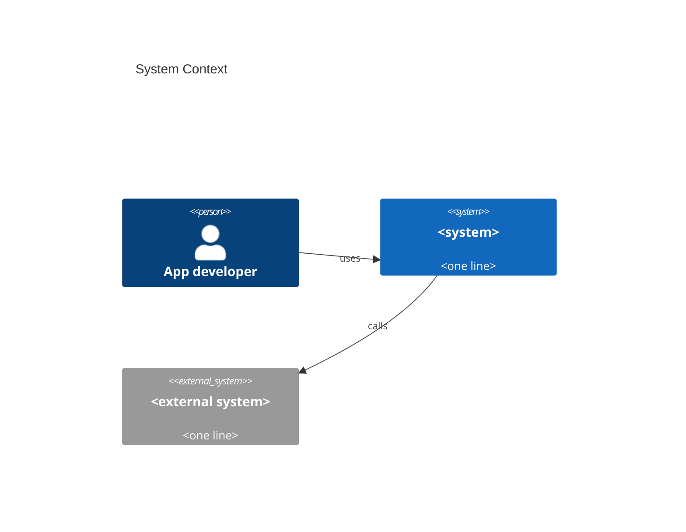
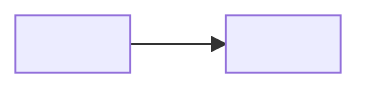
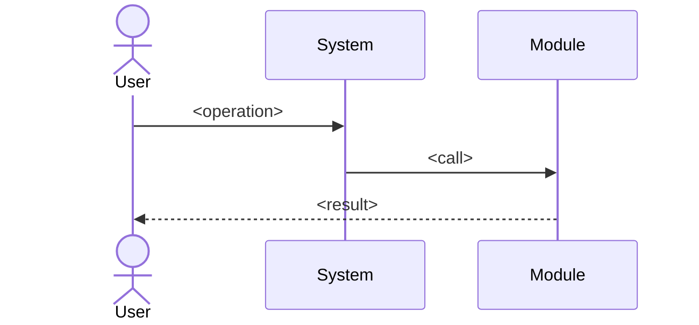

<!-- Reader: Maintainer · Mode: Explanation -->
# Architecture

> One paragraph: what this system is, at the altitude a new maintainer needs before reading on.

## 1. Context

Who/what uses this system, and what it depends on.

*What to notice: <the one thing this diagram is meant to show>.*

## 2. Containers

The deployable/runnable pieces and how they communicate.

*What to notice: <…>.*

## 3. Components / modules

Internal structure. For Metaphor modules, the DDD 4-layer shape; for the CLI, the
plugin/subprocess model.

- **<layer/component>** — responsibility, what it may and may not depend on.

## 4. Data & control flow

Trace one representative operation end-to-end.

1. Trigger → 2. … → 3. … → 4. Result.

*What to notice: <…>.*

## Key decisions

Link to the ADRs that explain why this architecture, not another.

- [ADR-NNNN](./adr-NNNN.md) — <decision>.
